# Performance Benchmarks

### Graph Builder Operations

**Adding Nodes**

Benchmark: Adding 100,000 nodes to a graph builder. Each node has a single "Person" label.

**Adding Relationships**

Benchmark: Adding 100,000 relationships to a graph with 100,000 nodes (2x relationships per node). Creates a ring structure where each node connects to the next.

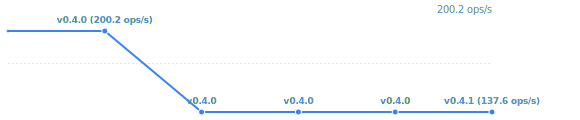

**Finalizing Graph**

Benchmark: Finalizing a graph builder with 100,000 nodes and 100,000 relationships, converting it to an immutable snapshot. This includes all internal optimizations and data structure transformations.

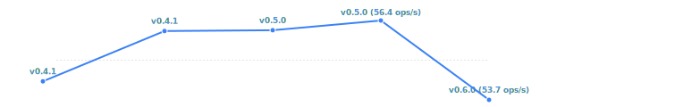

**Node Deduplication (Single Key)**

Benchmark: Adding 100,000 nodes with deduplication enabled on the "email" property. Every 10 nodes share the same email address, testing the overhead of deduplication logic.

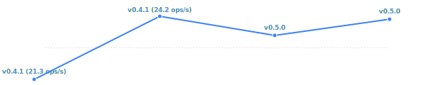

**Node Deduplication (Multi-Key)**

Benchmark: Adding 100,000 nodes with deduplication enabled on multiple properties ("email" and "username"). Every 10 nodes share the same email+username combination, testing multi-key deduplication performance.

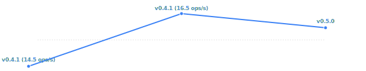

### Graph Snapshot Operations

**Getting Neighbors**

Benchmark: Querying neighbors for nodes in a graph with 100,000 nodes and 200,000 relationships (average degree of 2).

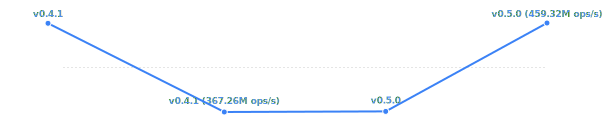

**Getting Neighbors (High-Degree Node)**

Benchmark: Querying neighbors for a hub node with 10,000 outgoing relationships in a graph with 100,000 nodes. Tests performance when retrieving a large number of neighbors from a single high-degree node.

**Getting Property**

Benchmark: Retrieving string properties from nodes in a graph with 100,000 nodes. Each node has a "name" property.

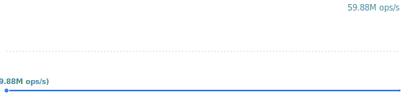

**Getting Property (Many Nodes)**

Benchmark: Retrieving properties from multiple nodes (100 nodes) in a graph with 10,000 nodes. Each node has multiple properties ("name", "id", "email"). Tests batch property retrieval performance.

**Getting Degree**

Benchmark: Calculating node degree by querying neighbors for nodes in a graph with 100,000 nodes and 200,000 relationships.

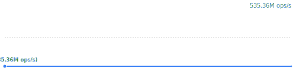

**Getting Nodes by Label**

Benchmark: Querying nodes by label in a graph with 100,000 nodes. Tests label-based node filtering performance.

**2-Hop Traversal**

Benchmark: Performing 2-hop traversal on a graph with 1,000,000 nodes and ~8,000,000 relationships (average degree of 8). The graph uses realistic branching. Traversal explores neighbors of neighbors starting from a single node.

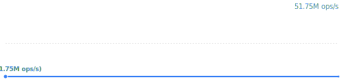

### Bulk Loading

**Loading Nodes**

Benchmark: Bulk loading 1,000,000 nodes from Parquet format into a graph snapshot.

**Loading Nodes (100k)**

Benchmark: Bulk loading 100,000 nodes from Parquet format into a graph snapshot.

**Loading Nodes with Deduplication (100k)**

Benchmark: Bulk loading 100,000 nodes from Parquet format with deduplication enabled on the "email" property. Tests the overhead of deduplication during bulk loading.

**Loading Nodes with Deduplication (1M)**

Benchmark: Bulk loading 1,000,000 nodes from Parquet format with deduplication enabled on the "email" property. Tests deduplication performance at scale.

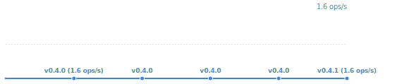

### Graph Traversal

**BFS Traversal**

Benchmark: Breadth-first search on a graph with 1,000,000 nodes and ~8,000,000 relationships (average degree of 8). The graph uses realistic branching with a mix of local connections (ring structure) and long-range connections. Traversal starts from the first 10% of nodes (100,000 start nodes).

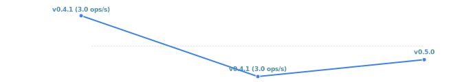

**Bidirectional BFS**

Benchmark: Bidirectional breadth-first search on a graph with 1,000,000 nodes and ~8,000,000 relationships (average degree of 8). The graph uses realistic branching with a mix of local connections and long-range connections. Source nodes are the first 10% (100,000 nodes), target nodes are the last 10% (100,000 nodes).

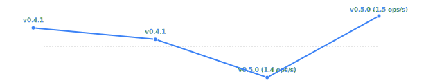

*Note: These charts show performance trends over time. Badge colors indicate performance changes: 🟢 improvement, 🟡 neutral, 🔴 regression.*

