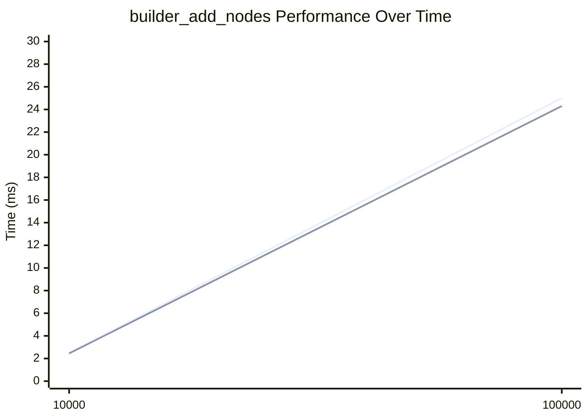

# Benchmark Tracking System

This document describes the benchmark tracking system for RustyChickpeas, which allows you to track performance metrics across versions and generate comparison charts.

## Overview

The system consists of three main components:

1. **Criterion.rs** - Runs the actual benchmarks
2. **save_benchmark_results.py** - Extracts results from Criterion and saves to versioned JSON files
3. **generate_benchmark_charts.py** - Generates comparison charts and updates documentation

## Quick Start

### Complete Workflow (Recommended)

Run the complete workflow script that does everything:

```bash
./scripts/run_benchmark_workflow.sh
```

This will:
1. Run all benchmarks
2. Save results to JSON files
3. Generate comparison charts
4. Update the performance README

### Step-by-Step Workflow

If you prefer to run steps individually:

#### 1. Run Benchmarks

```bash
# Run all benchmarks
cargo bench --bench graph_builder --bench graph_snapshot --bench bulk_load

# Or run for a specific tag (for comparison)
export BENCHMARK_BASELINE=v0.3.0
cargo bench --bench graph_builder --bench graph_snapshot --bench bulk_load
```

#### 2. Save Results to JSON

```bash
# Auto-detect version from git
./scripts/save_benchmark_results.py

# Or specify a version manually
./scripts/save_benchmark_results.py --version v0.4.0
```

This creates a JSON file like `benchmarks/benchmarks_v0.4.0.json` with all benchmark results.

#### 3. Generate Charts and Documentation

```bash
# Update README and generate comparison charts
./scripts/generate_benchmark_charts.py --update-readme --compare

# Or just update README
./scripts/generate_benchmark_charts.py --update-readme

# Or generate charts for a specific version
./scripts/generate_benchmark_charts.py --version v0.4.0
```

## File Structure

```
benchmarks/
├── benchmarks_v0.3.0.json      # Benchmark results for v0.3.0
├── benchmarks_v0.4.0.json       # Benchmark results for v0.4.0
└── charts/                     # Generated PNG charts
    ├── builder_add_nodes_comparison.png
    ├── builder_add_relationships_comparison.png
    └── ...

rustychickpeas-core/benches/
└── PERFORMANCE.md              # Auto-generated performance documentation
```

## JSON Format

Each benchmark JSON file contains:

```json
{
  "version": "v0.4.0",
  "system": {
    "date": "2024-12-15T10:30:00",
    "platform": "darwin",
    "rust_version": "rustc 1.75.0",
    "cpu": "Apple M1"
  },
  "benchmarks": {
    "builder_add_nodes": {
      "10000": {
        "mean_ms": 2.45,
        "mean_ci_lower_ms": 2.40,
        "mean_ci_upper_ms": 2.50,
        "median_ms": 2.44,
        "std_dev_ms": 0.05
      },
      "100000": {
        "mean_ms": 24.3,
        ...
      }
    },
    ...
  }
}
```

## Tracking Performance Across Versions

### For a New Release

1. **Before tagging a release**, run benchmarks:
   ```bash
   ./scripts/run_benchmark_workflow.sh
   ```

2. **Commit the results**:
   ```bash
   git add benchmarks/benchmarks_*.json
   git add rustychickpeas-core/benches/PERFORMANCE.md
   git commit -m "Add benchmark results for v0.4.0"
   ```

3. **Tag the release**:
   ```bash
   git tag v0.4.0
   ```

### Comparing Two Versions

To compare performance between two versions:

```bash
# Compare v0.3.0 (baseline) vs current
export BENCHMARK_BASELINE=v0.3.0
cargo bench --bench graph_builder --bench graph_snapshot --bench bulk_load

# Or use the comparison script
./scripts/compare_benchmarks.sh v0.3.0 v0.4.0
```

Criterion will generate HTML reports showing the comparison in `target/criterion/`.

### Historical Tracking

The JSON files serve as a permanent record of performance. You can:

- **View trends**: The `PERFORMANCE.md` file shows tables and Mermaid charts
- **Generate charts**: PNG charts in `benchmarks/charts/` show visual comparisons
- **Analyze data**: JSON files can be processed by other tools

## Chart Types

### Markdown Tables

The `PERFORMANCE.md` file includes markdown tables showing performance across versions:

| Size | v0.3.0 | v0.4.0 |
|------|--------|--------|
| 10,000 | 2.50 ms | 2.45 ms |
| 100,000 | 25.0 ms | 24.3 ms |

### Mermaid Charts

Mermaid charts embedded in the README show trends over time:



### PNG Charts

High-resolution PNG charts are generated in `benchmarks/charts/` for:
- Standalone viewing
- Documentation
- Presentations
- Reports

## Customization

### Adding New Benchmarks

To track a new benchmark:

1. Add the benchmark group name to `BENCHMARK_GROUPS` in both scripts
2. Add size configuration to `BENCHMARK_SIZES` in `generate_benchmark_charts.py`

### Changing Output Locations

Use command-line arguments:

```bash
# Custom benchmarks directory
./scripts/save_benchmark_results.py --output-dir my_benchmarks/

# Custom chart output
./scripts/generate_benchmark_charts.py --output-dir my_benchmarks/charts/
```

## Dependencies

- **Python 3.6+** - Required for all scripts
- **matplotlib** - Optional, for PNG chart generation
  ```bash
  pip install matplotlib
  ```

If matplotlib is not available, the system will still generate markdown tables and Mermaid charts, but skip PNG generation.

## Integration with CI/CD

You can integrate benchmark tracking into your CI/CD pipeline:

```yaml
# Example GitHub Actions workflow
- name: Run benchmarks
  run: cargo bench --bench graph_builder --bench graph_snapshot --bench bulk_load

- name: Save benchmark results
  run: python3 scripts/save_benchmark_results.py --version ${{ github.ref_name }}

- name: Generate charts
  run: python3 scripts/generate_benchmark_charts.py --update-readme --compare

- name: Upload benchmark artifacts
  uses: actions/upload-artifact@v3
  with:
    name: benchmarks-${{ github.ref_name }}
    path: |
      benchmarks/
      rustychickpeas-core/benches/PERFORMANCE.md
```

## Troubleshooting

### No benchmark data found

If you see "No benchmark data found":
1. Make sure you've run `cargo bench` first
2. Check that `target/criterion/` exists and contains benchmark results
3. Verify the benchmark group names match between your benchmarks and the scripts

### Charts not generating

If PNG charts aren't being created:
1. Check if matplotlib is installed: `pip install matplotlib`
2. Verify the `--compare` flag is used
3. Ensure you have at least 2 versions of benchmark data

### Version detection issues

If version auto-detection fails:
- Use `--version` flag to specify manually
- Check that you're in a git repository
- Verify `Cargo.toml` has a version field

## Best Practices

1. **Run benchmarks in a consistent environment** - Same machine, same conditions
2. **Save results for every release** - Creates a complete historical record
3. **Commit JSON files** - They're small and provide permanent tracking
4. **Review charts before releases** - Catch performance regressions early
5. **Use tags for versions** - Makes it easier to track and compare

## Related Scripts

- `benchmark_tag.sh` - Run benchmarks for a specific git tag
- `compare_benchmarks.sh` - Compare two tags using Criterion's built-in comparison
- `generate_performance_readme.py` - Original script (still works, but new system is recommended)

